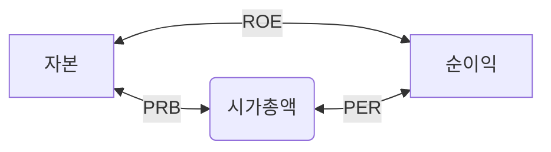

# 주식 알아할 용어

## 증거금률
- 주식을 매수할때 사용할 수 있는 대출한도. 레버리지.
- 증거금률이 낮으면 가치가 높다. 
- 증거금률이 낮다 -> 레버지리가 높다. -> 투자금보다 많이 매수할수 있다 -> 수급이 좋을 수 있다. 

## 이익
- 매출 총이익 : 사업을 통해 억은 이익
  - 매출 총이익 = 매출액 - 매출원가
- 영업이익 : 매출 총이익에서 판매비와 관리비를 뺀값
  - 영업이익 = 매출 총이익 - 판매비 및 관리비
- 경상이익 : 주된 사업 이익(영업이익)외 수익/손실
  - 경상이익 = 영업이익 + 영업 외 수익 - 영업 외 비용
- 순이익 : 경상이익에서 특별이익/특별소실, 법인세등을 제한 것, 순이익은 영업이익의 70~80%
  - 순이익 = 경상이익 + 특별이익 - 특별손실 - 세금
 
## PER 
- 주가수익배수 (Price Earning Ratio)
- 순이익 대비 시가총액 
  - 시가총액 10억인 회사의 영업이익이 2억이면 PER 은 5배
  - 주가가 떨어져 시가총액이 8억이 되면 PER은 4배가 됨
- 시가총액의 변화에 순이익이 영향을 받지 않는다.
- 미래가치에대한 기대가 높으면 주가가 상승하여 PER이 높다.
- 신기술, 테크, 바이오 등의 성장이 기대되는 주식은 PER이 높다
- 정통산업, 은행등 안정적이고 변동성이 낮은 사업은 PER이 낮다.
- 동일업종 회사를 비교하여 PER이 낮은 것은 관심가질만함. 
- PER이 낮은 이유에 기업이슈가 있을수 있다.
  - 오너리크스, 분식회게, 기업가치를 떨어뜨리는 사건,사고
- 저PER

## PBR
- 주가순자산배수 (Price Book-value Ratio)
- 주가를 주당 순자산가치 (BPS, Book-value Per Share)로 나눈 비율
- 주가와 1주당 순자산을 비교한 수치
  - 순자산 10억인 회사의 BPS가 2억이라면 PBR은 0.2
- PBR 계산에 사용되는 자산규모 측정의 객관성이 떨어질수 있다.
- 저PBR

## PSR
- 주가매출액배수 (Prise Sales Ratio)
- 1개의 주식으로 얻을 수 있는 매출의 크기
- 천원으로 천원 매출 vs 만원으로 만원 매출
- PSR과 매출 증감률(직전 결산대비, 전년대비, 동기대비) 울 같이 봐야함

## PCR
- 주가현금흐름배수 (Price Cash flow Ratio)
- 현금흐름은 현금유입과 현금유출의 차이인 순현금흐름을 말한다.
- 현금흐름은 기업의 부도가능성을 예측하는데 중요한 수치
- CPS (Cash flow per Share, 주당 현금흐름) 현금흐름을 총 주식 수로 나눈 값
  - 100원 수익을 낸 회사의 현금흐름이 수익의 100%인 100이고, 주가 1000원 총 주식수가 10개라면
    - CPS = 100(현금흐름) % 10(주식수) = 10
    - PCR = 1000(주가) % 10(CPS) = 100배
  - 100원 수익을 낸 회사의 현금흐름이 수익의 50%인 50이고, 주가 1000원 총 주식수가 10개라면
    - CPS = 50(현금흐름) % 10(주식수) = 5
    - PCR = 1000(주가) % 5(CPS) = 200배
- PCR이 낮을 수록 저평가
- PCR이 낮다고 무조건 좋은가? PER, PBR, PSR 과 유기적으로 파악해야 한다.

## PEG

## ROE

## ROA

## EV/EBITDA

## 52주 최저가 대비율

## 부채비율

## 유동비율

## 배당 수익률

## 외국인 비율

## NCAV

# 기업의 사업보고서
- [다트 https://dart.fss.or.kr](https://dart.fss.or.kr)
- 분기경과 후 45일내에 제출하는 분기 보고서
- 6개월 간의 사업내용을 반기 경과 후 45일 내에 제출하는 반기 보고서
- 사업 연도 경과 후 90일 내에 제출하는 사업 보고서
- 보통 12월을 연도말로 결산해서 3월이 사업보고서 제출 기한임.
- 실적이 아주 좋거나 반대일 것으로 확실시 된다면 3월 말 이전에 매매

## 회사의 개요
- <b>자본금 변동사항</b>
  - 자본금 증가/감소, 전환사채 발행이력, 유상증자
- 주식 총수, 배당
- <b>신용평가항목</b>

## 사업내용
- 무엇을 하는 회사인지
- 경쟁사 현황
- 매출 현황, 국내 매출/해외 매출, 매출 비중

# 재무
## 재무상태표
- 재무 안정성 평가
- 자산
  - 1년이내 현금화 가능한 유동자산
    - 유동자산이 클수록 재무상황이 안정적
  - 비유동자산
- 부채
  - 1년이내 상환해야할 유동부채
  - 비유동부채
- 자산/부채 비율, 유동자산 유동부채 비율, 전년 대비등
  
## 손익계산서
- 기업의 사업성과를 파악
- 매출. 매출원가, 판매비, 관리비 등의 규모와 증감
- 영업이익 등의 성과

## 현금흐름표
- 영업활동으로 인한 현금흐름
- 투자활동으로 인한 현금흐름
- 재무활동으로 인한 현금흐름
- 현금 및 현금성 자산의 증감

