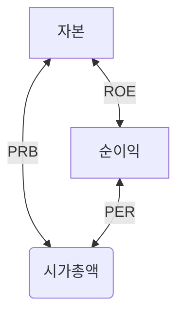

# 주식 알아할 용어

## 증거금률
- 주식을 매수할때 사용할 수 있는 대출한도. 레버리지.
- 증거금률이 낮으면 가치가 높다. 
- 증거금률이 낮다 -> 레버지리가 높다. -> 투자금보다 많이 매수할수 있다 -> 수급이 좋을 수 있다. 

## 이익
- 매출 총이익 : 사업을 통해 억은 이익
  - 매출 총이익 = 매출액 - 매출원가
- 영업이익 : 매출 총이익에서 판매비와 관리비를 뺀값
  - 영업이익 = 매출 총이익 - 판매비 및 관리비
- 경상이익 : 주된 사업 이익(영업이익)외 수익/손실
  - 경상이익 = 영업이익 + 영업 외 수익 - 영업 외 비용
- 순이익 : 경상이익에서 특별이익/특별소실, 법인세등을 제한 것, 순이익은 영업이익의 70~80%
  - 순이익 = 경상이익 + 특별이익 - 특별손실 - 세금
 
## PER 
- 주가수익배수 (Price Earning Ratio)
- 순이익 대비 시가총액 
- 시가총액 10억인 회사의 영업이익이 2억이면 PER 은 5배
- 주가가 떨어져 시가총액이 8억이 되면 PER은 4배가 됨
- 시가총액의 변화에 순이익이 영향을 받지 않는다.
- 미래가치에대한 기대가 높으면 주가가 상승하여 PER이 높다.
- 신기술, 테크, 바이오 등의 성장이 기대되는 주식은 PER이 높다
- 정통산업, 은행등 안정적이고 변동성이 낮은 사업은 PER이 낮다.
- 동일업종 회사를 비교하여 PER이 낮은 것은 관심가질만함. 저PER
- PER이 낮은 이유에 기업이슈가 있을수 있다.
  - 오너리크스, 분식회게, 기업가치를 떨어뜨리는 사건,사고

## PBR
- 주가순자산배수 (Price Book-value Ratio)
- 주가를 주당 순자산가치 (BPS, Book-value Per Share)로 나눈 비율
- 주가와 1주당 순자산을 비교한 수치
- 순자산 10억인 회사의 BPS가 2억이라면 PBR은 0.2
- PBR 계산에 사용되는 자산규모 측정의 객관성이 떨어질수 있다.
- 저PBR

